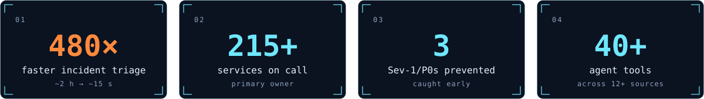

  

  
  
  

<picture>
  <source media="(prefers-color-scheme: dark)" srcset="assets/divider-dark.svg">
  <source media="(prefers-color-scheme: light)" srcset="assets/divider-light.svg">
  
</picture>

### `01` &nbsp;Whoami

I build autonomous LLM agents that investigate production incidents, and keep the **215+ services** underneath them reliable. Running in production, not demos.

I also design and build **websites** for people who want theirs to say something.

<code>Software Engineer, SRE & AI Tooling</code> &nbsp;at Netradyne, Bengaluru &nbsp;·&nbsp; <code>B.E. AI & ML</code> &nbsp;GPA 9.24/10

<picture>
  <source media="(prefers-color-scheme: dark)" srcset="assets/impact-dark.svg">
  <source media="(prefers-color-scheme: light)" srcset="assets/impact-light.svg">
  
</picture>

### `02` &nbsp;Shipped

<table>
<tr>
<td width="50%" valign="top">

**TraceLens** &nbsp;

An autonomous root-cause agent. A native ReAct loop on GPT-4o, no agent frameworks, **40+ tools across 12+ sources**. It returns ranked, confidence-scored hypotheses, files the Jira ticket and posts the Slack summary, then remembers the incident in a knowledge graph on Apache AGE. **1,094 tests.**

</td>
<td width="50%" valign="top">

**LogAgent** &nbsp;

A ReAct agent with read-only bash on the log server, reading **200k–30M lines per service per day**. No ingestion pipeline, no vector DB, no grep one-liners to regret later. Used by the SRE team.

</td>
</tr>
<tr>
<td width="50%" valign="top">

**Teardown** &nbsp;

Paste a URL. A real browser renders it, **65 rules plus axe-core** pin every problem, and you get a fix list an AI coding agent can execute.

</td>
<td width="50%" valign="top">

**Stockroom** &nbsp;

Orders that survive concurrency: **row-locked transactions**, idempotent order creation, audit logs and request-ID JSON logging.

</td>
</tr>
</table>

Also in production: <b>AlertFlow</b>, which folds alert storms into one triage queue across 185+ services, and an in-house Sentry replacement.

<picture>
  <source media="(prefers-color-scheme: dark)" srcset="assets/divider-dark.svg">
  <source media="(prefers-color-scheme: light)" srcset="assets/divider-light.svg">
  
</picture>

### `03` &nbsp;Websites, with a point of view

Fast, accessible, and impossible to mistake for a template. The proof is public: [Teardown](https://teardown-lab.vercel.app) and [the portfolio](https://krisharyan.vercel.app).

### `04` &nbsp;Toolkit

<table>
<tr><td><b>AGENTS</b></td><td>

</td></tr>
<tr><td><b>BUILD</b></td><td>

</td></tr>
<tr><td><b>SHIP</b></td><td>

</td></tr>
<tr><td><b>RUN</b></td><td>

</td></tr>
<tr><td><b>WATCH</b></td><td>

</td></tr>
<tr><td><b>STORE</b></td><td>

</td></tr>
</table>

### `05` &nbsp;Published & certified

&nbsp; **Privacy-Preserving Border Surveillance System** 
&nbsp; **Real-Time Biometric Facial Recognition Attendance System**

<picture>
  <source media="(prefers-color-scheme: dark)" srcset="assets/divider-dark.svg">
  <source media="(prefers-color-scheme: light)" srcset="assets/divider-light.svg">
  
</picture>

  <i>Bengaluru · on call, in spirit.</i> 
  <code>END OF LINE.</code>

