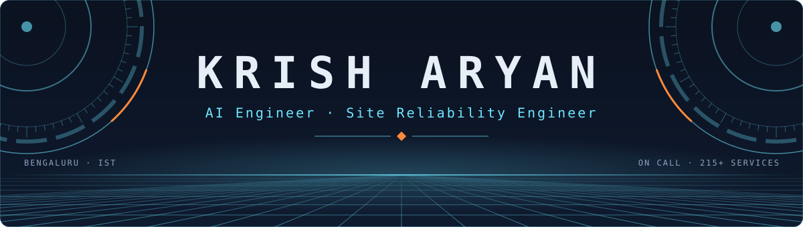

  <picture>
    <source media="(prefers-color-scheme: dark)" srcset="assets/banner-dark.svg">
    <source media="(prefers-color-scheme: light)" srcset="assets/banner-light.svg">
    
  </picture>

  <picture>
    <source media="(prefers-color-scheme: dark)" srcset="assets/tagline-dark.svg">
    <source media="(prefers-color-scheme: light)" srcset="assets/tagline-light.svg">
    
  </picture>

  
  
  

<picture>
  <source media="(prefers-color-scheme: dark)" srcset="assets/divider-dark.svg">
  <source media="(prefers-color-scheme: light)" srcset="assets/divider-light.svg">
  
</picture>

### ◆ About me

- **Software Engineer, SRE & AI Tooling** at Netradyne, Bengaluru, since Feb 2025
- Primary on-call owner for **215+ services**, so I build agents that take the first look at an incident before a human has to
- Built **TraceLens**, which takes incident triage from **~2 hours to ~15 seconds**. Running in production, not demos
- I also design and build **websites** for people who want theirs to say something
- **B.E. AI & ML**, GPA 9.24/10, and two peer-reviewed papers

<picture>
  <source media="(prefers-color-scheme: dark)" srcset="assets/impact-dark.svg">
  <source media="(prefers-color-scheme: light)" srcset="assets/impact-light.svg">
  
</picture>

<picture>
  <source media="(prefers-color-scheme: dark)" srcset="assets/divider-dark.svg">
  <source media="(prefers-color-scheme: light)" srcset="assets/divider-light.svg">
  
</picture>

### ◆ Featured work

**TraceLens** · *production, private*

> An autonomous root-cause agent. A native ReAct loop on GPT-4o, no agent frameworks, drives **40+ tools across 12+ sources**,
> returns ranked, confidence-scored hypotheses, then files the Jira ticket and posts the Slack summary.
> It learns from every incident in a knowledge graph on Apache AGE. **1,094 tests.**

  
  
  
  
  
  
  

**LogAgent** · *production, private*

> A ReAct agent with read-only bash on the log server, reading **200k–30M lines per service per day**.
> No ingestion pipeline, no vector DB, no grep one-liners to regret later. Used by the SRE team.

  
  
  

**Teardown** · *live*

> Paste a URL. A real browser renders it, 65 rules plus axe-core pin every problem,
> and you get a fix list an AI coding agent can execute.

  
  
  
  
  

**Stockroom** · *live*

> Orders that survive concurrency: row-locked transactions, idempotent order creation,
> audit logs and request-ID JSON logging.

  
  
  
  
  
  

Also in production: **AlertFlow**, which folds alert storms into one triage queue across 185+ services, and an in-house Sentry replacement.

<picture>
  <source media="(prefers-color-scheme: dark)" srcset="assets/divider-dark.svg">
  <source media="(prefers-color-scheme: light)" srcset="assets/divider-light.svg">
  
</picture>

### ◆ Websites

Fast, accessible, and impossible to mistake for a template. The proof is public: [Teardown](https://teardown-lab.vercel.app) and [the portfolio](https://krisharyan.vercel.app).

  

<picture>
  <source media="(prefers-color-scheme: dark)" srcset="assets/divider-dark.svg">
  <source media="(prefers-color-scheme: light)" srcset="assets/divider-light.svg">
  
</picture>

### ◆ Tech stack

**AI & agents**

  
  
  
  
  

**Languages & backend**

  
  
  
  
  

**Frontend**

  
  
  
  

**Cloud & DevOps**

  
  
  
  
  
  

**Observability**

  
  
  
  
  
  

**Data**

  
  
  
  
  

<picture>
  <source media="(prefers-color-scheme: dark)" srcset="assets/divider-dark.svg">
  <source media="(prefers-color-scheme: light)" srcset="assets/divider-light.svg">
  
</picture>

### ◆ Research & credentials

- **[Privacy-Preserving Border Surveillance System](https://ieeexplore.ieee.org/document/10714893)** · I-SMAC 2024, IEEE Xplore
- **[Real-Time Biometric Facial Recognition Attendance System](https://thegrenze.com/index.php?display=page&view=journalabstract&absid=3411&id=8)** · ACT 2024, GRENZE (Scopus)

  
  
  

<picture>
  <source media="(prefers-color-scheme: dark)" srcset="assets/divider-dark.svg">
  <source media="(prefers-color-scheme: light)" srcset="assets/divider-light.svg">
  
</picture>

<i>Bengaluru, India · on call, in spirit. Messages that don't open with "hope this finds you well" get answered first.</i>

