<!-- Generated by tools/src/readme/build.ts from README.template.md and content/profile.json. Do not edit by hand. -->

<picture>
  <source media="(prefers-reduced-motion: reduce)" srcset="assets/hero-poster.png">
  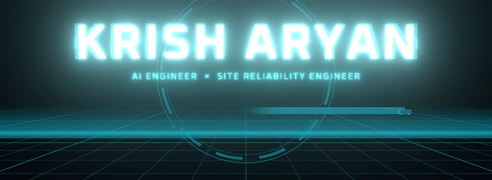
</picture>

<p align="center">
  
</p>

I build AI agents that investigate production incidents on their own, and I keep the 215+ services underneath them reliable. Not demos. Not POCs. Running in production.

I also design and build websites for people who want theirs to say something. Two lanes below: pick yours.

<p align="center">
  <a href="#the-investigation">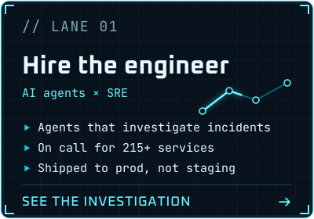</a>
  <a href="#websites-with-a-point-of-view">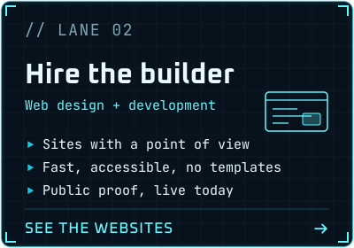</a>
</p>


## Impact



<details>
<summary>Impact and timeline as text</summary>

- **480×** faster triage (~2 h → ~15 s)
- **215+** services on call (primary owner)
- **3** Sev-1/P0s prevented (caught early)
- **40+** agent tools (12+ sources)
- **1,094** automated tests (on TraceLens)

Intern to Software Engineer in 12 months (1 yr 9 mos at Netradyne so far):

- **Feb 2025**: Cloud Intern, Netradyne. Built AlertFlow.
- **Jul 2025**: Associate SRE, Netradyne. Built TraceLens.
- **Feb 2026**: Software Engineer - SRE, Netradyne. AI-tooling lead, SRE org.

</details>

## The investigation

What TraceLens does to an incident, done to me instead. Synthetic tool names, real numbers.


<details>
<summary>Read the trace as text</summary>

```text
$ investigate "krish aryan"
    --sources resume,portfolio,github

THINK  Real person? Real production?
CALL   get_impact("incident_response")
OBS    triage ~2 h → ~15 s (480×) on AWS EKS
CALL   get_oncall_record()
OBS    215+ services · 3 Sev-1/P0 prevented
THINK  Framework, or spec and stubbornness?
CALL   inspect_method("tracelens")
OBS    native ReAct loop · no agent frameworks
OBS    40+ tools · 12+ sources · 1,094 tests
CALL   get_career("netradyne")
OBS    intern → engineer in 12 months

RANKED HYPOTHESES
H1  Hire Krish                       0.97
H2  Hire Krish, but sooner           0.02
H3  Leave the 3AM page to a human    0.01

✓ jira ticket filed · slack summary posted
```

</details>

## Systems shipped

The headline work runs in production at my employer, so the code is private. These cards say what each system does, and the case studies are on [the portfolio](https://krisharyan.vercel.app/work).

<p align="center">
  <a href="https://krisharyan.vercel.app/work">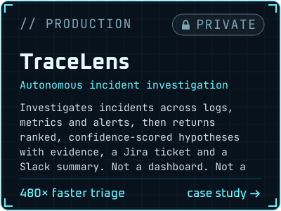</a>
  <a href="https://krisharyan.vercel.app/work">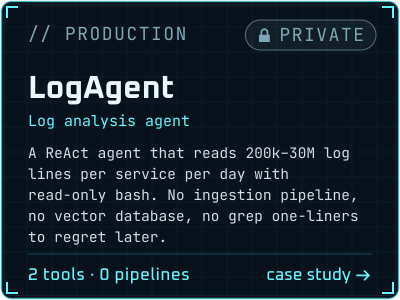</a>
  <a href="https://krisharyan.vercel.app/work">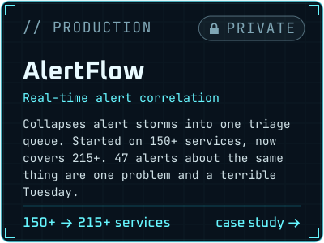</a>
  <a href="https://krisharyan.vercel.app/work">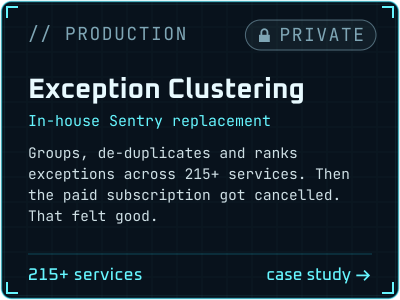</a>
</p>

Two public systems you can open right now:

<p align="center">
  <a href="https://teardown-lab.vercel.app">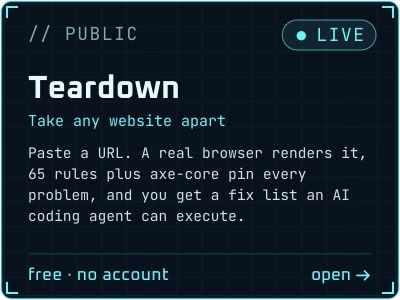</a>
  <a href="https://github.com/KrishAryan12/stockroom#readme">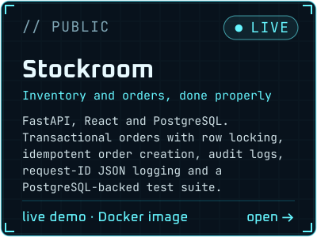</a>
</p>

<p align="center">
  <b>Teardown</b>: <a href="https://teardown-lab.vercel.app">live</a> · <a href="https://github.com/KrishAryan12/Teardown">repo</a>
  &nbsp;|&nbsp;
  <b>Stockroom</b>: <a href="https://stockroom-fv47.onrender.com/">live</a> · <a href="https://stockroom-api-yvum.onrender.com/docs">API docs</a> · <a href="https://github.com/KrishAryan12/stockroom">repo</a> · <a href="https://hub.docker.com/r/krisharyan12/stockroom">Docker image</a>
</p>

<!--
  PLACEHOLDER (hidden until it exists): mini-TraceLens, a small public ReAct agent that investigates a
  synthetic incident. When the repo is public, add it to content/profile.json -> systems.public.
-->

## The Grid

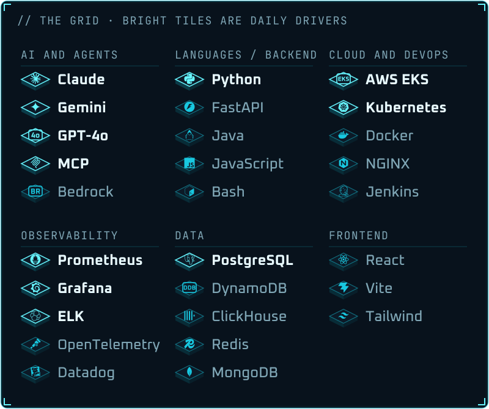

<details>
<summary>The stack as text</summary>

- **AI and agents**: **Claude**, **Gemini**, **GPT-4o** (Azure OpenAI), **MCP**, Bedrock (AWS Bedrock)
- **Languages / backend**: **Python**, FastAPI, Java, JavaScript, Bash
- **Cloud and DevOps**: **AWS EKS**, **Kubernetes**, Docker, NGINX, Jenkins
- **Observability**: **Prometheus**, **Grafana**, **ELK**, OpenTelemetry, Datadog
- **Data**: **PostgreSQL**, DynamoDB, ClickHouse, Redis, MongoDB
- **Frontend**: React, Vite, Tailwind

Bold entries are the daily drivers.

</details>


## Websites with a point of view

Fast, accessible, and impossible to mistake for a template. The proof is public: Teardown has to pass its own audit at 95+ in every Lighthouse category before it ships.

<p align="center">
  <a href="https://teardown-lab.vercel.app">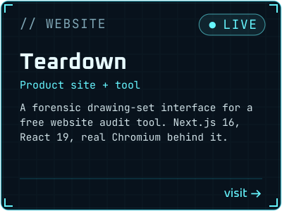</a>
  <a href="https://krisharyan.vercel.app">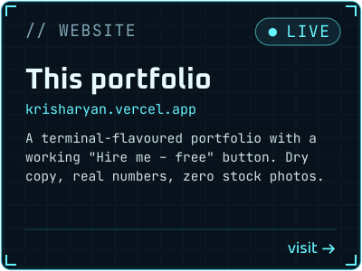</a>
</p>

<p align="center">
  <a href="https://krisharyan.vercel.app/contact"></a>
</p>

## Research and credentials

Two peer-reviewed papers, published before I graduated (B.E., Artificial Intelligence & Machine Learning, GPA 9.24/10).

<p align="center">
  <a href="https://ieeexplore.ieee.org/document/10714893">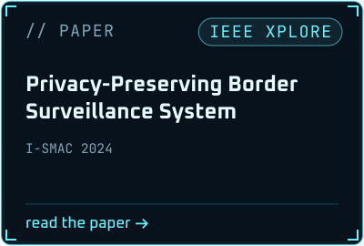</a>
  <a href="https://thegrenze.com/index.php?display=page&view=journalabstract&absid=3411&id=8">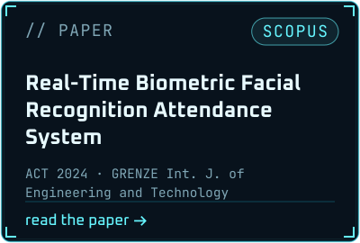</a>
</p>

- [Privacy-Preserving Border Surveillance System](https://ieeexplore.ieee.org/document/10714893), I-SMAC 2024 (IEEE Xplore)
- [Real-Time Biometric Facial Recognition Attendance System](https://thegrenze.com/index.php?display=page&view=journalabstract&absid=3411&id=8), ACT 2024 · GRENZE Int. J. of Engineering and Technology (Scopus) · [code](https://github.com/KrishAryan12/Real-Time-Facial-Recognition-Attendance-System)

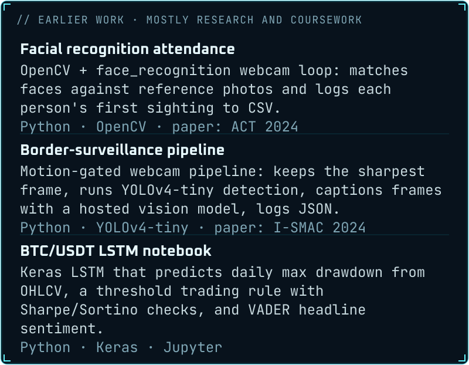

<details>
<summary>Earlier work as text</summary>

- **[Facial recognition attendance](https://github.com/KrishAryan12/Real-Time-Facial-Recognition-Attendance-System)**: OpenCV + face_recognition webcam loop: matches faces against reference photos and logs each person's first sighting to CSV. *Python · OpenCV · paper: ACT 2024*
- **Border-surveillance pipeline**: Motion-gated webcam pipeline: keeps the sharpest frame, runs YOLOv4-tiny detection, captions frames with a hosted vision model, logs JSON. *Python · YOLOv4-tiny · paper: I-SMAC 2024*
- **[BTC/USDT LSTM notebook](https://github.com/KrishAryan12/Market-Analysis-of-BTC-USDT)**: Keras LSTM that predicts daily max drawdown from OHLCV, a threshold trading rule with Sharpe/Sortino checks, and VADER headline sentiment. *Python · Keras · Jupyter*

</details>

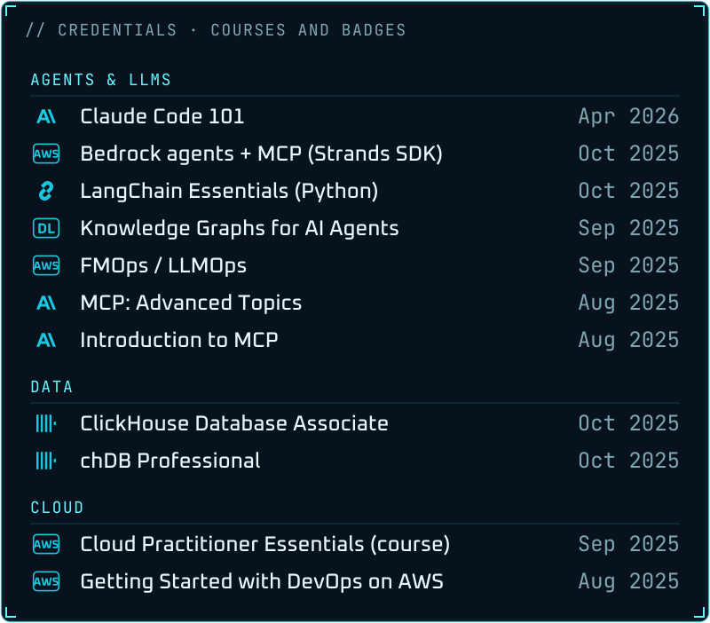

<details>
<summary>Credentials, with verify links</summary>

These are course certificates and badges, not proctored certifications.

| Group | Credential | Issuer | Issued | Verify |
|---|---|---|---|---|
| Agents & LLMs | Claude Code 101 | Anthropic | Apr 2026 | [verify](https://verify.skilljar.com/c/h3uewwhjaepk) |
| Agents & LLMs | Integrating Amazon Bedrock powered Agents with Model Context Protocol Servers using the Strands Agents SDK | AWS | Oct 2025 | no public link |
| Agents & LLMs | LangChain Essentials - Python | LangChain | Oct 2025 | [verify](https://academy.langchain.com/certificates/8g0v1xpggw) |
| Agents & LLMs | Knowledge Graphs for AI Agent: API Discovery | DeepLearning.AI | Sep 2025 | [verify](https://learn.deeplearning.ai/accomplishments/ceaf2f1f-0a34-4e96-9f2e-c6307022a4e3) |
| Agents & LLMs | Operationalize Generative AI Applications (FMOps/LLMOps) | AWS | Sep 2025 | no public link |
| Agents & LLMs | Model Context Protocol: Advanced Topics | Anthropic | Aug 2025 | [verify](https://verify.skilljar.com/c/4aphiibon45o) |
| Agents & LLMs | Introduction to Model Context Protocol | Anthropic | Aug 2025 | [verify](https://verify.skilljar.com/c/nzmm3g8t9dbu) |
| Data | ClickHouse Database Associate | ClickHouse | Oct 2025 | [verify](https://www.credly.com/badges/c569bec6-94e8-4aea-995d-45ca5c1be0a3/public_url) |
| Data | chDB Professional | ClickHouse | Oct 2025 | [verify](https://www.credly.com/badges/53ec6458-ecd6-416a-88b6-ad951bfd82fe/public_url) |
| Cloud | AWS Cloud Practitioner Essentials | AWS | Sep 2025 | no public link |
| Cloud | Getting Started with DevOps on AWS | AWS | Aug 2025 | no public link |

Also completed: Generative AI with Diffusion Models (AWS, Sep 2025).

</details>


## Live telemetry

Regenerated daily by a GitHub Action in this repo. No third-party cards, no counters, no tracking.


## Uplink

<p align="center">
  <a href="https://krisharyan.vercel.app"></a>
  <a href="https://www.linkedin.com/in/krisharyan"></a>
  <a href="https://krisharyan.vercel.app/contact">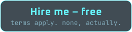</a>
  <a href="https://krisharyan.vercel.app/resumes/Krish_Aryan_AI_Engineer_Resume.pdf"></a>
  <a href="https://krisharyan.vercel.app/resumes/Krish_Aryan_SRE_Resume.pdf"></a>
</p>

I read every message. The bar is just: don't open with "hope this finds you well."

---

<p align="center">
  <b>End of line.</b><br>
  <sub></sub><br>
  <sub>Every panel here is generated from one JSON file and committed. <a href="tools/">How this README is built</a>.</sub><br>
  <sub>Inspired by a film I watch too often. Not affiliated with it.</sub>
</p>
